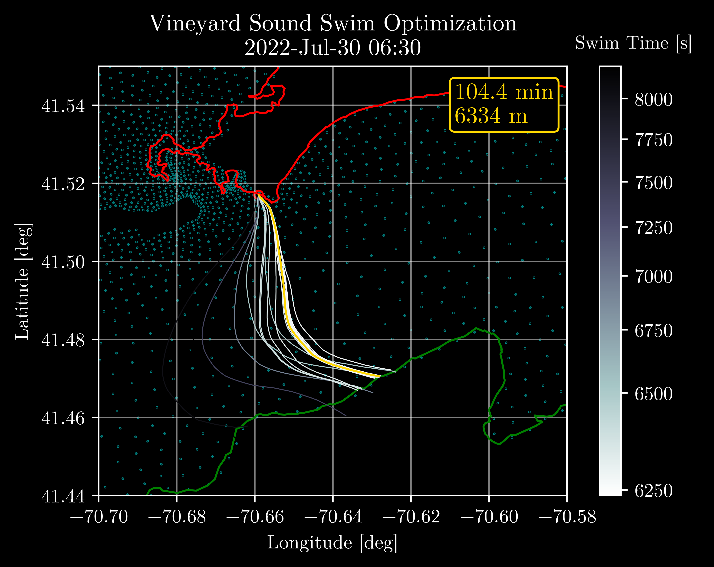
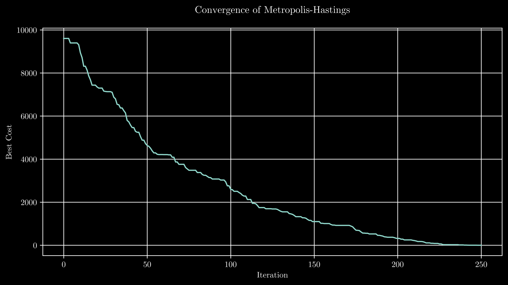

# mv-mcmc
Determine the best possible constant-pace swim route from Woods Hole to Martha's Vineyard, given a known start time and location.

Check out the basic [MCMC Demo Code](/src/mcmc_demo_1d.py), too -- it really works!

